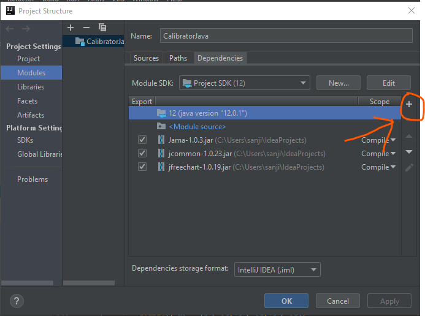
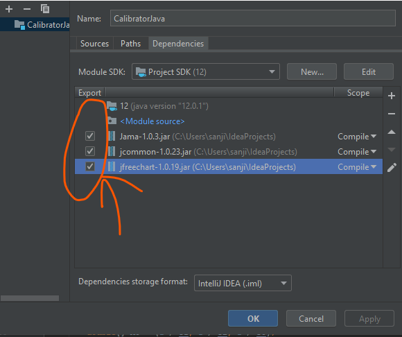

# Thermistor Calibrator Java

Thermistor Calibrator is an open source IntelliJ program, that can be used to Calibrate NTC Thermistors. 
Most useful for Calibrating Thermistors offline during competitions like scioly.

##  Usage
Go to  the [releases](https://github.com/Sanjit1/CalibratorJava/releases) page and download the [latest release jar file](https://github.com/Sanjit1/CalibratorJava/releases/latest). Then just double click it to run it from your computer.

## Contributing
- To get started with this repo clone it:`` git clone https://github.com/Sanjit1/CalibratorJava.git``

- Download
	- [Jama](https://math.nist.gov/javanumerics/jama/Jama-1.0.2.har)
	- [Jcommon](https://sourceforge.net/projects/jfreechart/files/3.%20JCommon/1.0.23/)
	- [Jfree Chart](http://repo1.maven.org/maven2/org/jfree/jfreechart/1.0.19/jfreechart-1.0.19.jar)

- Add the modules by going to Files -> Project Structure -> Modules and click the + sign.

	

- Click jars or directories and locate the location where you downloaded the jar files, and select all of them. and click ok. Then select them like this:

- 

	And open it with IntelliJ. Now you can play around with the code!

 
 Visit my [site](sanjit1.github.io/Calibrator/index.html) to learn how to use a thermistor and how to Calibrate a thermistor
 

